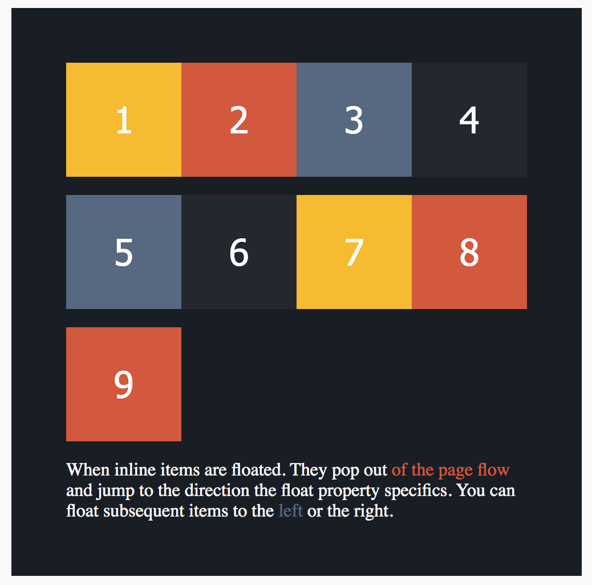

# Float And Clear Exercise

### Instructions:

1. `git clone git@github.com:JoshuaMaddox/mentee.git`
2. Once you've cloned the repo, open index.html in your preferred browser.
3. Using only the css classes `float-right`, `float-left` or `clear-floats` (they're written for you) convert index.html to look like the image below by adding or removing the appropriate class to/from the appropriate HTML element. For Example. `<div class="box orange-helper">2</div>` could become:

```
<div class="box orange-helper float-right"></div>
<div class="box orange-helper float-left"></div>
<div class="box orange-helper clear-floats"></div>
```

##### Your final solution should look like:


