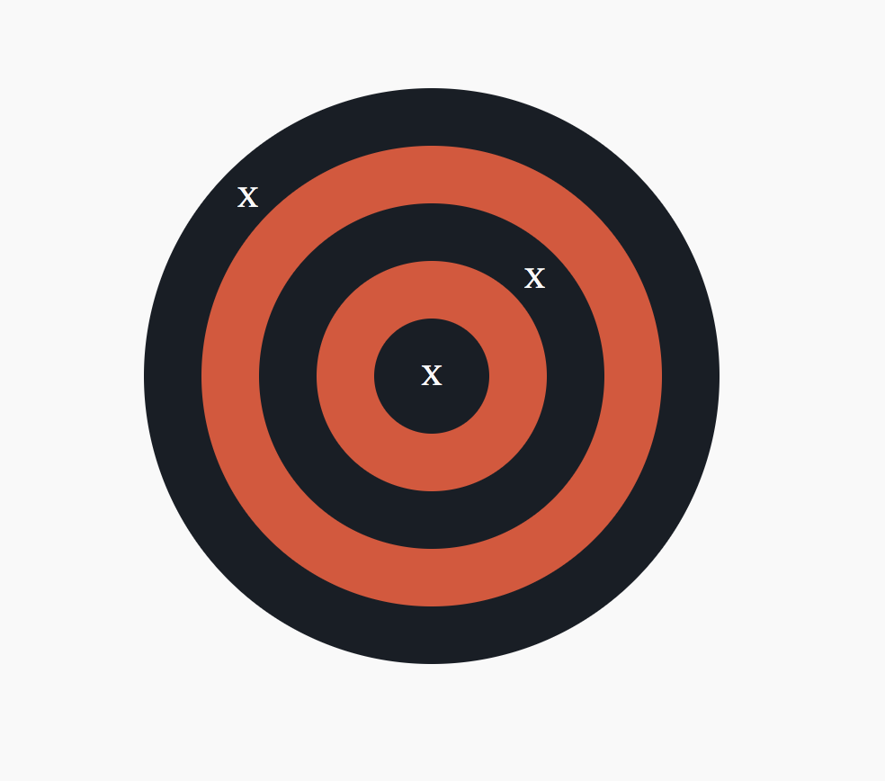

# Positioning Exercise

### Instructions:

1. `git clone git@github.com:JoshuaMaddox/mentee.git`
2. Once you've cloned the repo, open positioning/index.html in your preferred browser.
3. Go to styles.css and edit the classes below to recreate the example image (Do not make any changes to index.html. You should use CSS only):  
   `.circle-one`
   `.circle-two`
   `.circle-three`
   `.circle-four`
   `.circle-five`
   `.mark-one`
   `.mark-two`
   `.mark-three`

##### Your final solution should look like:

